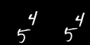

## Spatial-Temporal Transformer

### I. Vector-Quantized Autoencoders
- Vector-Quantized autoencoders are used to represent images in a compressed latent space. 
- For High-Resolution outputs, VQGANs (VQVAE trained with Discriminator) are a much better choice.
- The generative transformer model works on this compressed latent space of the images.
- The reason to work on a compressed latent space rather than the high-dimensional original input space is to reduce the computational load and memory requirements.

### II. Transformer 

#### 1. Spatial Attention
- Applies attention across all spatial elements(pixels) within each temporal unit.
- Captures spatial relationships within each temporal snapshot, enhancing the model's understanding of spatial dependencies.

#### 2. Spatial-Temporal Attention
- Executes attention across temporal units for each pixel independently.
- Captures temporal relationships between spatial elements(pixels), enabling the model to learn dynamics over time.

#### 3. Gaussian Parameterization
- A convolutional layer generates the parameters (mean and variance) of a normal distribution based on the outputs from the attention layers.
- Samples are drawn from the generated distribution.
- The sampled output is then passed to the subsequent transformer layer.
- This layer introduces stochasticity into the predictions, allowing the model to explore diverse outputs during the autoregressive process.

### Video Generative Models - Application
* **Video Generation models** are one of the applications of Spatial-Temporal Transformer with every frame of video serving as the temporal unit and each pixel in the frame (or image) representing a spatial unit. 
* The demo notebook and trained weights are available [here](https://www.kaggle.com/code/nithishm2410/spatialtemporaltransformer) and [here](https://drive.google.com/drive/folders/124KMh7YB_DaMtyaNsPxfkcpd0Be9y_34?usp=sharing) .  

      

* The left video is the **input prompt video** and right video is the **input prompt video plus the generated frames**. In this example, the input prompt video has 15 frames and model predicts the next 5 frames. So, the right video has 20 frames where the **last 5 frames are the generated**.
 
* *Note: Each frame in the above video is repeated by 10 to prolong the video. Actual number of frames are 15 and 20 for left and right video.*

### Future plans (more may be added)
* [x] Application of Spatial Temporal Transformer - Video Generation
* [ ] Use VQ autoencoders trained with discriminators (VQGAN) for High-resolution outputs.
